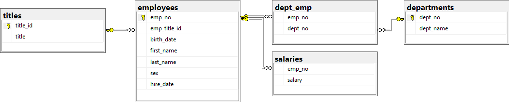
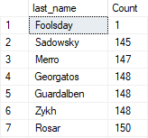

# Employee Hire Salary

## Introduction
Taking 6 csv files with information about employees when they were hired (including: salary, department, and position title), creating database relationships, and providng anlysis. Some general questions considered are...

-What is the distribution/budget of salaries by department and position?
-How how much was spent on salaries each year?

## Database Relationship

## Tableau Analysis

## Fake Data Evidence

Look at a count of all the last names available.

Inspect the employee with last name 'Foolsday'.

With this evidence, I can safely say that this dataset is not a real dataset.

## Contact
email: git@jakegeiser.us
