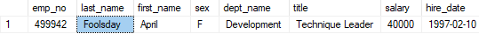

# Employee Hire Salary
- [Introduction](#introduction)
- [Database Relationship](#database-relationship)
- [Tableau Analysis](#tableau-analysis)
- [Further Evidence of Fake Data](#further-evidence-of-fake-data)
- [Contact](#contact)

## Introduction
Taking 6 csv files with information about employees when they were hired (including: salary, department, and position title), creating database relationships, and providng anlysis. Some general questions considered are...

-What is the distribution/budget of salaries by department and position?
-How how much was spent on salaries each year?

## Database Relationship

## Tableau Analysis

Tableau story can be found <a href="https://jakegeiser.github.io/employee-salary-sql/">here</a>.

The three seperate slides provide interactive visualizations that answer our two questions.

What is the distribution of salaries by department and position? Well, the results are shown in the visualizations quite clearly, the most noteworthy points are that the highest average salaries are in the Sales department and that the average salaries by position in each department doesn't really make sense. For example, the average salary for staff and senior staff are nearly identical in each department, this leads me to believe there is false data in the dataset, if not the entire dataset might be fabricated.

How much was spent on salaries each year? Easily seen in the first visualization in the tableau story, after the second year, the abount spent decreases linearly each year. This indicates that either most employees stay with the company and that fewer hires are required each year, or the company is declining; however, the linearity of the decline further suggests that the dataset is fabricated. Also, I noticed that for each year, the amount spent on each department for new hires is nearly identical (for example, customer service is around 23-24% each year, except for 2000 where very few new employees were hired.

## Further Evidence of Fake Data

Look at a count of all the last names available.

Inspect the employee with last name 'Foolsday'.

With this evidence, I can safely say that this dataset is not a real dataset.

## Contact
email: git@jakegeiser.us
